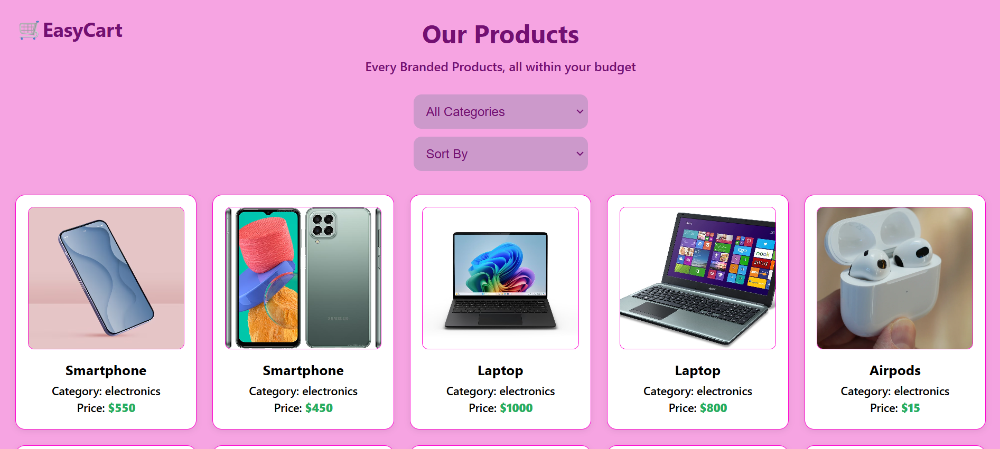

## 🛒 EasyCart – Your Budget-Friendly Online Store

EasyCart is a responsive and visually appealing online store interface built to showcase electronic products in a clean and organized layout. It offers category filtering, price sorting, and a great user experience for shoppers.

### ✨ Features
- 💻 Display of multiple electronic items with images, category, and price
- 🔍 Filter by category
- 📊 Sort items based on preference
- 🎨 Beautifully styled UI with responsive design

### 🛠️ Tech Stack
- HTML5
- CSS3
- JavaScript

### 📸 Preview


### 📁 Project Setup
```bash
1. Clone the repo:
git clone https://github.com/vinaya2007/EasyCart.git


2. Navigate to the project folder:
cd EasyCart

3. Open index.html in your browser.
```

📬 Contact 

📧 vinayavinodh07@gmail.com 

📞 +91 90032 80933

Credits Built by Vinaya V
